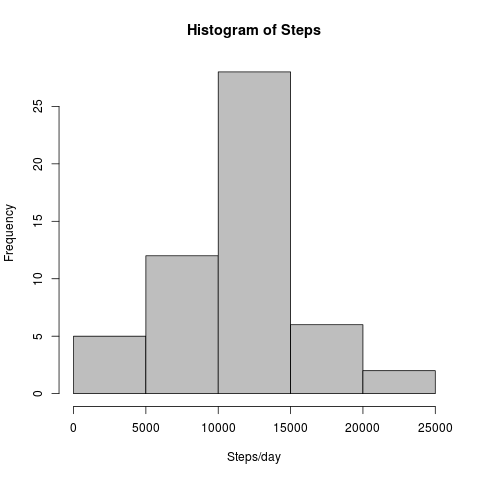
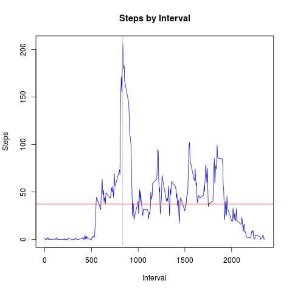
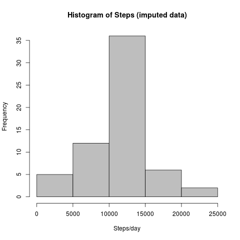

***
This research uses data from a personal activity monitoring device that collects data in 5 minute intervals through the day for a two months period.
It intends to analyze the daily activity patterns in order to identify differences between weekdays and weekends.


***
## Loading and preprocessing the data

First we load the zipped csv data into the **activity** data frame.

``` {r echo = TRUE}
activity <- read.csv(unzip("activity.zip"))
```

We have tree variables

* steps
* date
* interval 

and 2304 NAs in steps measurements.

```{r echo = TRUE}
str(activity)
summary(activity)
```

Since date is a Factor, we need to convert it to Date.
```{r echo = TRUE}
activity$date <- as.Date(activity$date)
```


***
## What is mean total number of steps taken per day?
We start summarizing the steps per day with the following code:

```{r echo=TRUE}
stepsbyday <- aggregate(activity$steps, list(by=activity$date), FUN=sum, na.rm=F)
names(stepsbyday) <- c("date", "steps")
summary(stepsbyday)
```

```{r echo=FALSE, results="hide", fig.show="hide"}
par(mfrow=c(1,1))
hist(stepsbyday$steps, col="grey", main="Histogram of Steps", xlab="Steps/day")
dev.copy(png, "figure/HistogramOfSteps.png")
dev.off()
```



Total steps by day has is has a normal distribution with a **Mean of `r mean(stepsbyday$steps, na.rm=T)` and a Median of `r median(stepsbyday$steps, na.rm=T)` steps/day**.


***
## What is the average daily activity pattern?
To analyze the daily activity pattern we aggregate the steps by interval, and compute the mean as follows:

```{r echo=TRUE}
stepsbyinterval <- aggregate(activity$steps, list(by=activity$interval), FUN=mean, na.rm=T)
names(stepsbyinterval) <- c("interval", "steps")
summary(stepsbyinterval)
```

```{r echo=FALSE, results="hide", fig.show="hide"}
plot(stepsbyinterval$interval, stepsbyinterval$steps, type="l", main="Steps by Interval", xlab="Interval", ylab="Steps", col="blue")
meansteps <- mean(stepsbyinterval$steps)
maxinterval <- stepsbyinterval[stepsbyinterval$steps==max(stepsbyinterval$steps),]
abline(stepsbyinterval, h=meansteps, col="red")
abline(stepsbyinterval, v=maxinterval$interval, col="grey")
dev.copy(png, "figure/StepsByInterval.png")
dev.off()
```



The average steps in a 5 minute interval is `r meansteps`.

The maximum average number of steps in a 5 minute interval is `r maxinterval$steps`, and it's done on the interval `r maxinterval$interval`.


***
## Imputing missing values
In the **activity** data frame there are `r sum(is.na(activity$steps))` missing values.

We will create a new **mactivity** from **activity** data.frame in order to impute missing values. We will use the average steps per interval.

```{r echo=TRUE}
mactivity <- activity 
for (i in 1:nrow(mactivity)) {
    if (is.na(mactivity[i,"steps"])) {
        imputedsteps <- stepsbyinterval[stepsbyinterval$interval==mactivity[i,"interval"],"steps"]
        mactivity[i,"steps"] <- imputedsteps
    }
}
```


The following code summarizes the steps per day and create a new histogram with the new imputed data.
```{r echo=TRUE}
mstepsbyday <- aggregate(mactivity$steps, list(by=mactivity$date), FUN=sum, na.rm=F)
names(mstepsbyday) <- c("date", "steps")
summary(mstepsbyday)
```

```{r echo=FALSE, results="hide", fig.show="hide"}
hist(mstepsbyday$steps, col="grey", main="Histogram of Steps (imputed data)", xlab="Steps/day")
dev.copy(png, "figure/mHistogramOfSteps.png")
dev.off()
```



The **Mean is `r mean(mstepsbyday$steps, na.rm=T)` steps and the Median is `r median(mstepsbyday$steps, na.rm=T)` steps/day**.

The median and mean do not vary from the numbers estimated before imputing the missing values. So there is no major impact on imputing missing values.


***
## Are there differences in activity patterns between weekdays and weekends?
To compare steps in weekends with weekdays a factor variable **wd** is needed in the **mactivity** data frame.

```{r echo=TRUE}
mactivity$wd <- ifelse(format(mactivity$date, "%w") %in% c("1":"5"),"weekday", "weekend")
```

Next we need to group by **interval** and **wd** and calculate the mean.  The result is in **mstepsbyinterval**

```{r echo=TRUE}
mstepsbyinterval <- aggregate(mactivity$steps, list(a=mactivity$interval,b=mactivity$wd), FUN=mean, na.rm=T)
names(mstepsbyinterval) <- c("interval", "wd", "steps")
```

Now we can do the plot to compare activity between weekdays and weekend.

```{r echo=FALSE, results="hide", fig.show="hide"}
par(mfrow=c(1,2))

with(subset(mstepsbyinterval, wd=="weekday"), plot(interval, steps, main="Weekday", type="l", col="blue", ylim = c(0,230)))
abline(mstepsbyinterval, h=mean(subset(mstepsbyinterval, wd="weekday")$steps), col="red")

with(subset(mstepsbyinterval, wd=="weekend"), plot(interval, steps, main="Weekend", type="l", col="blue", ylim = c(0,230)))
abline(mstepsbyinterval, h=mean(subset(mstepsbyinterval, wd="weekend")$steps), col="red")
```

```{r echo=FALSE, results="hide", fig.show="hide",include=FALSE}
dev.copy(png, "figure/weekdayvsweekend.png")
dev.off()
```


The mean steps per interval (`r mean(subset(mstepsbyinterval, wd="weekday")$steps)`) seems to be the same all days. What varies is the distribution along the days. On weekdays the activity has a peak between 5am and 10am. Activity seems to start earlier than on weekends (5am). On weekends activity is evenly distributed along the day.

***
