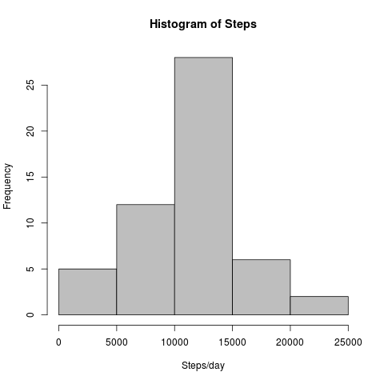
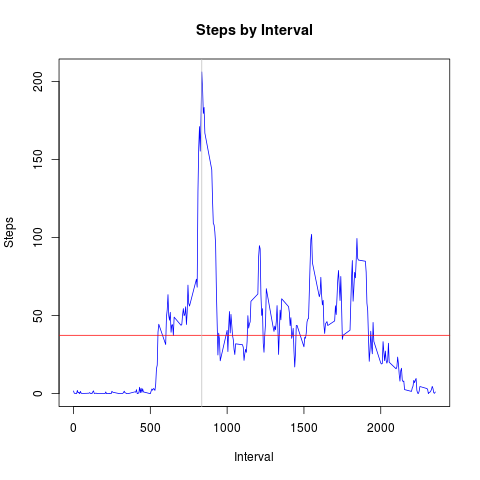
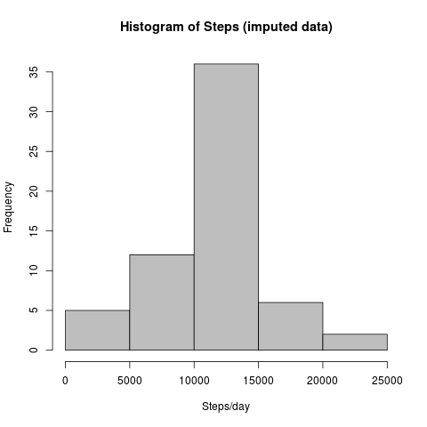
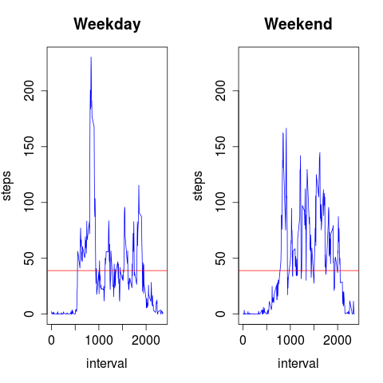

# Reproducible Research: Peer Assessment 1
Erick E. Fuentes  


***
This research uses data from a personal activity monitoring device that collects data in 5 minute intervals through the day for a two months period.
It intends to analyze the daily activity patterns in order to identify differences between weekdays and weekends.


***
## Loading and preprocessing the data

First we load the zipped csv data into the **activity** data frame.


```r
activity <- read.csv(unzip("activity.zip"))
```

We have tree variables

* steps
* date
* interval 

and 2304 NAs in steps measurements.


```r
str(activity)
```

```
## 'data.frame':	17568 obs. of  3 variables:
##  $ steps   : int  NA NA NA NA NA NA NA NA NA NA ...
##  $ date    : Factor w/ 61 levels "2012-10-01","2012-10-02",..: 1 1 1 1 1 1 1 1 1 1 ...
##  $ interval: int  0 5 10 15 20 25 30 35 40 45 ...
```

```r
summary(activity)
```

```
##      steps                date          interval     
##  Min.   :  0.00   2012-10-01:  288   Min.   :   0.0  
##  1st Qu.:  0.00   2012-10-02:  288   1st Qu.: 588.8  
##  Median :  0.00   2012-10-03:  288   Median :1177.5  
##  Mean   : 37.38   2012-10-04:  288   Mean   :1177.5  
##  3rd Qu.: 12.00   2012-10-05:  288   3rd Qu.:1766.2  
##  Max.   :806.00   2012-10-06:  288   Max.   :2355.0  
##  NA's   :2304     (Other)   :15840
```

Since date is a Factor, we need to convert it to Date.

```r
activity$date <- as.Date(activity$date)
```


***
## What is mean total number of steps taken per day?
We start summarizing the steps per day with the following code:


```r
stepsbyday <- aggregate(activity$steps, list(by=activity$date), FUN=sum, na.rm=F)
names(stepsbyday) <- c("date", "steps")
summary(stepsbyday)
```

```
##       date                steps      
##  Min.   :2012-10-01   Min.   :   41  
##  1st Qu.:2012-10-16   1st Qu.: 8841  
##  Median :2012-10-31   Median :10765  
##  Mean   :2012-10-31   Mean   :10766  
##  3rd Qu.:2012-11-15   3rd Qu.:13294  
##  Max.   :2012-11-30   Max.   :21194  
##                       NA's   :8
```




Total steps by day has is has a normal distribution with a **Mean of 1.0766189\times 10^{4} and a Median of 10765 steps/day**.


***
## What is the average daily activity pattern?
To analyze the daily activity pattern we aggregate the steps by interval, and compute the mean as follows:


```r
stepsbyinterval <- aggregate(activity$steps, list(by=activity$interval), FUN=mean, na.rm=T)
names(stepsbyinterval) <- c("interval", "steps")
summary(stepsbyinterval)
```

```
##     interval          steps        
##  Min.   :   0.0   Min.   :  0.000  
##  1st Qu.: 588.8   1st Qu.:  2.486  
##  Median :1177.5   Median : 34.113  
##  Mean   :1177.5   Mean   : 37.383  
##  3rd Qu.:1766.2   3rd Qu.: 52.835  
##  Max.   :2355.0   Max.   :206.170
```




The average steps in a 5 minute interval is 37.3825996.

The maximum average number of steps in a 5 minute interval is 206.1698113, and it's done on the interval 835.


***
## Imputing missing values
In the **activity** data frame there are 2304 missing values.

We will create a new **mactivity** from **activity** data.frame in order to impute missing values. We will use the average steps per interval.


```r
mactivity <- activity 
for (i in 1:nrow(mactivity)) {
    if (is.na(mactivity[i,"steps"])) {
        imputedsteps <- stepsbyinterval[stepsbyinterval$interval==mactivity[i,"interval"],"steps"]
        mactivity[i,"steps"] <- imputedsteps
    }
}
```


The following code summarizes the steps per day and create a new histogram with the new imputed data.

```r
mstepsbyday <- aggregate(mactivity$steps, list(by=mactivity$date), FUN=sum, na.rm=F)
names(mstepsbyday) <- c("date", "steps")
summary(mstepsbyday)
```

```
##       date                steps      
##  Min.   :2012-10-01   Min.   :   41  
##  1st Qu.:2012-10-16   1st Qu.: 9819  
##  Median :2012-10-31   Median :10766  
##  Mean   :2012-10-31   Mean   :10766  
##  3rd Qu.:2012-11-15   3rd Qu.:12811  
##  Max.   :2012-11-30   Max.   :21194
```




The **Mean is 1.0766189\times 10^{4} steps and the Median is 1.0766189\times 10^{4} steps/day**.

The median and mean do not vary from the numbers estimated before imputing the missing values. So there is no major impact on imputing missing values.


***
## Are there differences in activity patterns between weekdays and weekends?
To compare steps in weekends with weekdays a factor variable **wd** is needed in the **mactivity** data frame.


```r
mactivity$wd <- ifelse(format(mactivity$date, "%w") %in% c("1":"5"),"weekday", "weekend")
```

Next we need to group by **interval** and **wd** and calculate the mean.  The result is in **mstepsbyinterval**


```r
mstepsbyinterval <- aggregate(mactivity$steps, list(a=mactivity$interval,b=mactivity$wd), FUN=mean, na.rm=T)
names(mstepsbyinterval) <- c("interval", "wd", "steps")
```

Now we can do the plot to compare activity between weekdays and weekend.




The mean steps per interval (38.9884913) seems to be the same all days. What varies is the distribution along the days. On weekdays the activity has a peak between 5am and 10am. Activity seems to start earlier than on weekends (5am). On weekends activity is evenly distributed along the day.

***

